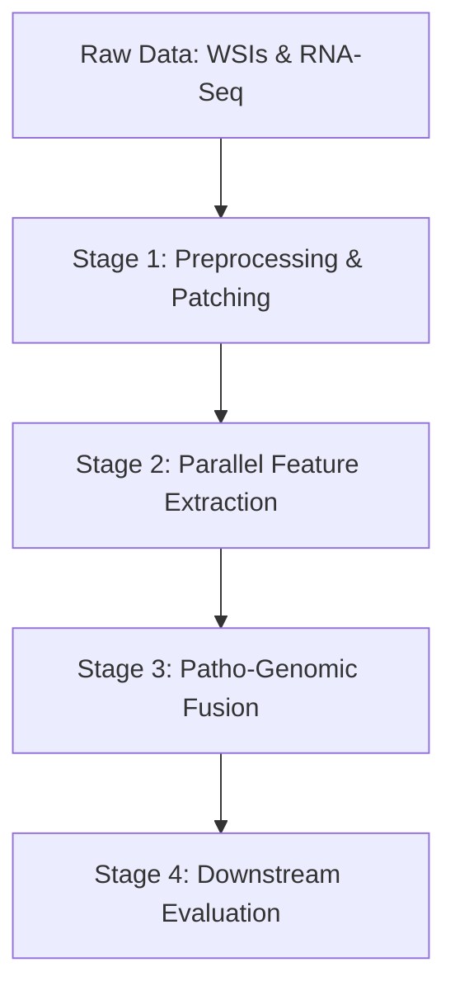

# 🚀 Usage Guide: Pathology-Genomic Fusion Pipeline

This guide outlines the end-to-end execution pipeline for the Pathology-Genomic Fusion framework. Follow these steps to prepare your data, extract multi-modal features, execute cross-attention fusion, and run downstream survival analysis or diagnostic classification.

---

## 🛠️ Pipeline Overview

The framework processes data through four discrete execution stages. Each stage can be run individually using the command-line interface (CLI) or managed end-to-end via the project `Makefile`.


## Stage 1: Data Preprocessing & Tissue Patching
Before feature extraction, raw Whole-Slide Images (WSIs) must be segmented, background-filtered, and tiled into non-overlapping patches.
### WSI Tiling & Segmentation
Extract tissue regions from .svs, .tif, or .ndpi gigapixel slides at $20\times$ magnification ($0.5\, \mu\text{m/pixel}$) into $224 \times 224$ patches.
``` text
python src/data/patch_wsi.py \
    --wsi_dir ./data/raw/wsis/ \
    --patch_dir ./data/interim/patches/ \
    --patch_size 224 \
    --magnification 20 \
    --seg_threshold 0.15 \
    --num_workers 8
```
Key Arguments:

-- seg_threshold: Otsu threshold multiplier to filter out background/slide whitespace (values between 0.10 and 0.20 recommended).

-- num_workers: Multi-processing workers for parallel slide CPU-bound patching.

### Genomic Profile Normalization
Preprocess raw RNA-Seq count matrices using Log-Transformed Transcripts Per Million ($\text{log}_2(\text{TPM} + 1)$) and scale z-scores across the cohort.
``` text
python src/data/preprocess_genomics.py \
    --counts_path ./data/raw/counts.csv \
    --output_path ./data/processed/genomics_scaled.parquet \
    --variance_filter 2000
```
## Stage 2: Parallel Feature Extraction
Extract parallel latent embeddings from the patched image directories and processed genomic files before feeding them into the fusion bottleneck.

### Histopathology Feature Extraction
Pass patches through a frozen foundation model backbone (e.g., Virchow or ViT-Large-Patch14) to generate patch-level spatial coordinate embeddings.

``` text
python src/features/extract_tissue_features.py \
    --patch_dir ./data/interim/patches/ \
    --output_dir ./data/processed/image_embeddings/ \
    --model_name virchow \
    --batch_size 256 \
    --device cuda
```
The output is saved as a unified .h5 or .pt array file per patient containing an $N \times 1280$ matrix, where $N$ represents the variable number of valid tissue patches extracted.

### Genomic Feature Encoding
Project high-dimensional genomic signatures ($2,000$ highly variable genes) into a compact molecular representation via the genomic MLP encoder.

``` text
python src/features/extract_genomic_features.py \
    --genomics_path ./data/processed/genomics_scaled.parquet \
    --output_dir ./data/processed/genomic_embeddings/ \
    --latent_dim 512
```

## Stage 3: Multi-Head Cross-Attention Fusion
Run the core fusion module to compute the cross-attention matrices where the genomic embedding acts as the Query ($Q$) to filter and aggregate the visual Keys ($K$) and Values ($V$).
``` text
python src/models/run_fusion.py \
    --image_emb_dir ./data/processed/image_embeddings/ \
    --genomic_emb_dir ./data/processed/genomic_embeddings/ \
    --config configs/model_config.yaml \
    --output_dir ./data/fused_patient_representations/
```
Example Configuration (configs/model_config.yaml)
``` text
fusion_bottleneck:
  query_dim: 512       # Genomic latent size
  key_value_dim: 1280  # Image patch embedding size
  num_heads: 8         # Attention heads
  dropout: 0.1
  hidden_dim: 512      # Post-attention projection layer
```
## Stage 4: Downstream Task Evaluation
Train and evaluate task-specific prediction heads using the fused multimodal representations.
### Survival Analysis (Cox Proportional Hazards Model)
Train the model optimizing negative Cox log-likelihood to predict patient-specific risk scores and calculate the Concordance Index ($C$-index).

``` text
python src/train.py \
    --task survival \
    --data_dir ./data/fused_patient_representations/ \
    --clinical_path ./data/raw/clinical_metadata.csv \
    --epochs 50 \
    --lr 0.0001 \
    --cv_folds 5
```
### Cancer Subtyping / Classification
Train a categorical classification head to predict distinct molecular subtypes or tumor staging metrics.
```
python src/train.py \
    --task classification \
    --data_dir ./data/fused_patient_representations/ \
    --num_classes 4 \
    --batch_size 32
```
## Automation via Makefile
For simplified, reproducible pipeline execution, use the global project Makefile. Ensure paths and environments are configured in your global workspace settings before executing.
``` text
make patch && make genomics && make extract_all && make fuse && make evaluate
```
