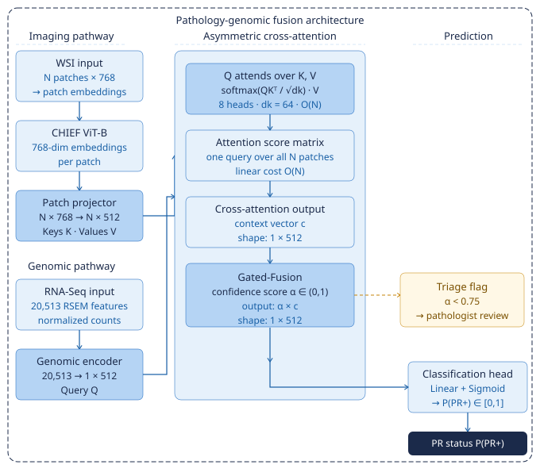

<h1>Asymmetric Cross-Attention Networks for Multimodal Integration in Pathology</h1>

Transcriptomics-Guided Cross-Attention for Breast Cancer PR Status Classification

Nisha Ramesh &nbsp;·&nbsp; Independent Research &nbsp;·&nbsp; 2026 &nbsp;·&nbsp; TCGA-BRCA Cohort · 951 patients

<a href="paper.html" class="btn btn-light btn-lg me-2">
Read the Paper →
</a>

<a href="https://github.com/nshramesh04/patho-genomic-fusion"
   class="btn btn-outline-light btn-lg"
   target="_blank">
View Code
</a>

ROC-AUC

0.8482

+0.0801 vs. late-fusion baseline

PR-AUC

0.9054

2:1 class imbalance

Patients

951

TCGA-BRCA cohort

Attention Separation

p = 0.018

PR phenotype distinction

---

Computational Pathology &nbsp;&nbsp;
Whole-Slide Imaging &nbsp;&nbsp;
RNA-Seq &nbsp;&nbsp;
Multimodal Fusion &nbsp;&nbsp;
Cross-Attention &nbsp;&nbsp;
Uncertainty Quantification &nbsp;&nbsp;
Breast Cancer

---

## Abstract {.unnumbered}

Accurate progesterone receptor (PR) status is a critical determinant of endocrine therapy eligibility in breast cancer. Although immunohistochemistry (IHC) remains the clinical standard, diagnostically ambiguous cases can exhibit substantial inter-pathologist variability. Pathology images alone often lack the molecular context needed to resolve these challenging receptor states, while conventional late-fusion multimodal models struggle to align transcriptomic information with localized histopathologic features.

To address this challenge, we present a multimodal clinical decision-support system that integrates RNA-Seq transcriptomic profiles with whole-slide imaging (WSI). Our asymmetric cross-attention architecture enables each patient's transcriptomic profile to guide visual evidence retrieval directly from tissue images before slide-level aggregation while maintaining linear computational complexity.

To improve reliability in clinical deployment, we introduce a Cross-Modal Reliability Estimator that produces calibrated per-patient confidence scores, automatically flagging ambiguous or discordant cases for pathologist review. We additionally propose a normalization-corrected Top-1%-Mass Concentration metric that quantifies attention localization consistently across slides of varying size.

Using the TCGA-BRCA cohort of 951 patients with matched transcriptomic and imaging data, our model achieved an ROC-AUC of **0.8482** and a PR-AUC of **0.9054**. Analysis of attention patterns revealed significant phenotypic separation between PR-positive and PR-negative tumors (*p* = 0.018), indicating that the model captures biologically meaningful spatial patterns associated with receptor status.

Together, these findings demonstrate that transcriptomics-guided cross-attention provides an effective framework for multimodal computational pathology and highlight the importance of rigorous interpretability metrics for revealing clinically relevant biological signals.

## Key Contributions & Findings {.unnumbered}

::: {.contributions}

- **Asymmetric Cross-Attention Architecture:** Developed an efficient $O(N)$ multimodal architecture in which transcriptomic embeddings guide visual evidence retrieval before slide-level aggregation, improving ROC-AUC by **+0.0801** over conventional late-fusion baselines.

- **Calibrated Clinical Safety Gate:** Introduced a Cross-Modal Reliability Estimator that computes calibrated per-patient confidence scores, automatically flagging uncertain predictions for expert pathologist review.

- **Size-Invariant Interpretability:** Designed a normalization-corrected attention concentration metric that removes slide-size bias, revealing statistically significant phenotype-specific attention patterns (*p* = 0.018).

:::

## Limitations {.unnumbered}

::: {.contributions}

- **Single-Cohort Validation:** The model was trained and evaluated exclusively on the TCGA-BRCA cohort. Performance across independent institutions, staining protocols, and acquisition platforms remains to be established.

- **Assay Availability:** The approach requires matched whole-transcriptome RNA-Seq data, which currently involves greater cost and turnaround time than standard H&E or standalone IHC workflows.

- **Vision Encoder Alignment:** The current vision encoder is pretrained exclusively on pathology images. Joint multimodal pretraining or transcriptomics-guided visual representation learning represents an important direction for future work.

:::

## Architecture Diagram {.unnumbered}

System architecture. The transcriptomic stream produces a single query token <em>Q</em> that attends over all <em>N</em> patch embeddings with linear computational complexity. Automated escalation is triggered when the calibrated confidence score falls below the predefined threshold (<em>α</em> &lt; 0.75).

---

::: {style="text-align:center; color:#94a3b8; font-size:0.85rem; margin-top:2.5rem; padding-bottom:1rem;"}

PyTorch · MONAI · CHIEF ViT-B · Scikit-learn &nbsp;·&nbsp;
[GitHub](https://github.com/nshramesh04/patho-genomic-fusion){target="_blank"} &nbsp;·&nbsp;
[MIT License](https://github.com/nshramesh04/patho-genomic-fusion/blob/main/LICENSE){target="_blank"}

:::