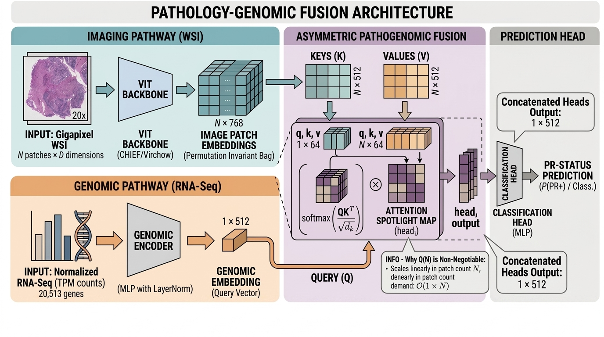

<h1>Asymmetric Cross-Attention Networks for Multimodal Integration in Pathology</h1>

Genomic-Conditioned Visual Search for PR-Status Classification in Breast Cancer

Nisha Ramesh &nbsp;·&nbsp; Independent Research &nbsp;·&nbsp; 2026 &nbsp;·&nbsp; TCGA-BRCA · N = 951

<a href="paper.html" class="btn btn-light btn-lg me-2">Read the Paper →</a>
<a href="https://github.com/nshramesh04/patho-genomic-fusion" class="btn btn-outline-light btn-lg" target="_blank">View Code</a>

ROC-AUC

0.8426

+0.0745 vs baseline

PR-AUC

0.9110

at 2:1 class imbalance

Patients

951

TCGA-BRCA cohort

Interpretability

p = 0.018

entropy: p = 0.401

---

System architecture — the genomic stream produces a single query token Q that attends over all N patch embeddings at O(N) cost.

---

## Key Contributions {.unnumbered}

::: {.contributions}
- **O(N) asymmetric cross-attention** — resolves the structural mismatch between fixed-length genomic vectors and variable-length WSI patch bags (960–39,052 patches per slide), with no positional encodings or bag compression.
- **Top-1%-Mass Concentration metric** — a slide-size-invariant alternative to Shannon entropy that recovers *p* = 0.018 phenotypic separation; entropy yields *p* = 0.401 on the same data due to the slide-size confound.
- **Cross-Modal Reliability Estimator** (Gated-Fusion v2) — 1,025 parameters producing a per-patient α ∈ (0,1) signal for automated triage of IHC-discordant borderline cases, at zero complexity cost.
- **+0.0745 ROC-AUC** over the late-fusion baseline, attributable to genomic conditioning applied *upstream* of visual compression — at the search stage, not the pooling stage.
:::

---

::: {style="text-align: center; color: #94a3b8; font-size: 0.85rem; margin-top: 2.5rem; padding-bottom: 1rem;"}
PyTorch · MONAI · CHIEF ViT-B · Scikit-learn &nbsp;·&nbsp;
[GitHub](https://github.com/nshramesh04/patho-genomic-fusion){target="_blank"} &nbsp;·&nbsp;
[MIT License](https://github.com/nshramesh04/patho-genomic-fusion/blob/main/LICENSE){target="_blank"}
:::
